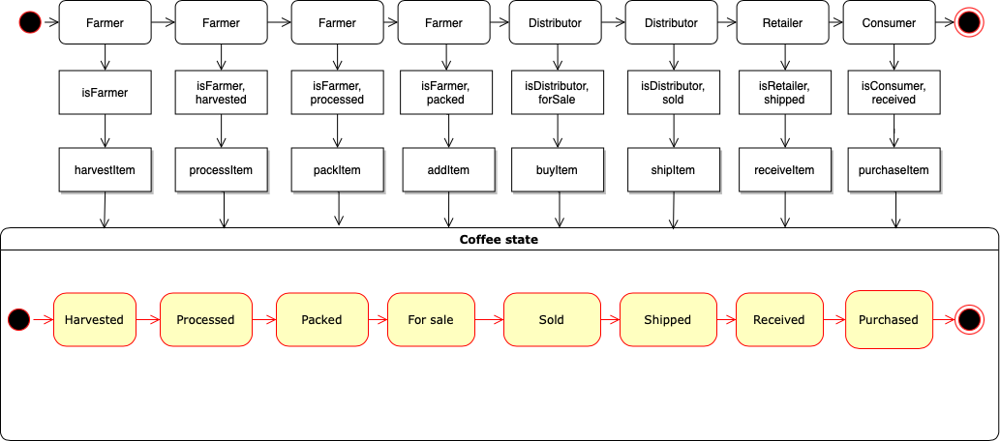

# Supply chain & data auditing

This repository containts an Ethereum DApp that demonstrates a Supply Chain flow between a Seller and Buyer. The user story is similar to any commonly used supply chain process. A Seller can add items to the inventory system stored in the blockchain. A Buyer can purchase such items from the inventory system. Additionally a Seller can mark an item as Shipped, and similarly a Buyer can mark an item as Received.

The DApp User Interface when running should look like...


# Project Summary

### Testnet deployment (Rinkeby)
SupplyChain contract:
* Transaction: [0xa070a725991a5e9dfa035a34c93c0e1ec293d75515f68d5265025d686dfbd8da](https://rinkeby.etherscan.io/tx/0xa070a725991a5e9dfa035a34c93c0e1ec293d75515f68d5265025d686dfbd8da)
* Contract addresss: [0x10bdf2136d3ce0fb5838744b128c25ecb7860fbb](https://rinkeby.etherscan.io/address/0x10bdf2136d3ce0fb5838744b128c25ecb7860fbb)

## UML Diagrams
### Activitity Diagram


### Sequence Diagram


### State Diagram


### Class Diagram


## Libraries
No external libraries were used in the implementation.

## IPFS
IPFS was not used in this project.

# Usage

## Getting Started

These instructions will get you a copy of the project up and running on your local machine for development and testing purposes. See deployment for notes on how to deploy the project on a live system.

### Prerequisites

Please make sure you've already installed ganache-cli, Truffle and enabled MetaMask extension in your browser.

### Installing

A step by step series of examples that tell you have to get a development env running

Clone this repository:

```
git clone https://github.com/theiberg/blockchaindev/tree/main/project3
```

Change directory to the ```code``` folder and install all requisite npm packages (as listed in ```package.json```):

```
cd code
npm install
```

Launch Ganache:

```
ganache-cli -m "spirit supply whale amount human item harsh scare congress discover talent hamster"
```

Your terminal should look something like this:


In a separate terminal window, Compile smart contracts:

```
truffle compile
```

Your terminal should look something like this:


This will create the smart contract artifacts in folder ```build\contracts```.

Migrate smart contracts to the locally running blockchain, ganache-cli:

```
truffle migrate
```

Your terminal should look something like this:


Test smart contracts:

```
truffle test
```

All 10 tests should pass.


In a separate terminal window, launch the DApp:

```
npm run dev
```

## Built With

* [Ethereum](https://www.ethereum.org/) - Ethereum is a decentralized platform that runs smart contracts
* [Truffle Framework](http://truffleframework.com/) - Truffle is the most popular development framework for Ethereum with a mission to make your life a whole lot easier.
